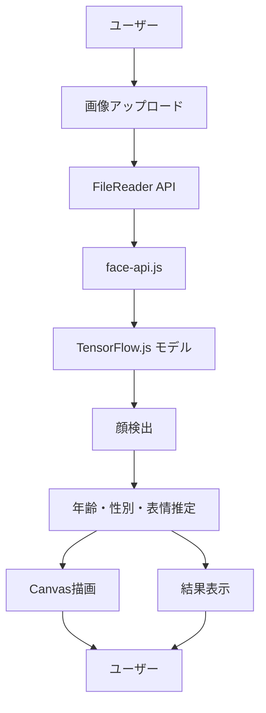

# 🤖 AI年齢推定アプリ

[](https://YOUR_USERNAME.github.io/age-recognition-app/)
[](LICENSE)
[](https://developer.mozilla.org/en-US/docs/Web/JavaScript)
[](https://github.com/vladmandic/face-api)

> **TensorFlow.jsとface-api.jsを使用した、プライバシー重視のブラウザベース年齢推定アプリ**


## ✨ 特徴

- 🎯 **高精度AI分析**: TensorFlow.jsベースの先進的な顔検出・年齢推定
- 👥 **複数人対応**: 1枚の画像で複数の顔を同時に分析
- 🎭 **多角的分析**: 年齢・性別・表情を総合的に判定
- 🔒 **完全プライベート**: 画像は全てブラウザ内で処理、外部送信なし
- 🎨 **モダンUI**: 明るくスタイリッシュなレスポンシブデザイン
- ⚡ **高速処理**: CDN最適化による快適なユーザー体験
- 🔧 **手動修正機能**: AI判定が不確実な場合の性別変更機能

## 🛠 技術スタック

| 技術 | 用途 | バージョン |
|-----|------|-----------|
| **HTML5** | マークアップ | - |
| **CSS3** | スタイリング（グラスモーフィズム） | - |
| **JavaScript ES6+** | アプリケーションロジック | - |
| **face-api.js** | 顔検出・AI分析 | @vladmandic/face-api |
| **TensorFlow.js** | 機械学習推論 | via face-api.js |
| **Google Fonts** | タイポグラフィ | Poppins |
| **Font Awesome** | アイコン | 6.5.1 |

## セットアップ方法

### 1. ファイルをダウンロード

このフォルダ内の全ファイルをダウンロードしてください：
- index.html
- style.css
- script.js
- README.md

## 🚀 クイックスタート

### デモを試す
👉 **[ライブデモはこちら](https://YOUR_USERNAME.github.io/age-recognition-app/)**

### ローカル環境での実行

1. **リポジトリをクローン**
```bash
git clone https://github.com/YOUR_USERNAME/age-recognition-app.git
cd age-recognition-app
```

2. **ローカルサーバーを起動** ⚠️ 重要
```bash
# Python 3を使用
python3 -m http.server 8000

# または Node.js を使用
npx http-server . -p 8000

# または PHP を使用  
php -S localhost:8000
```

3. **ブラウザでアクセス**
   - http://localhost:8000 を開く
   - 画像をアップロードして分析開始！

> 💡 **なぜローカルサーバーが必要？**  
> CORS制限により、HTMLファイルを直接開くとAIモデルの読み込みに失敗します。

## 💻 使用方法

### 基本的な使い方
1. 🖱️ **「画像をアップロード」** ボタンをクリック
2. 📁 顔が写っている画像ファイルを選択
3. ⚡ AIが自動で顔を検出・分析
4. 📊 年齢・性別・表情の結果を確認

### 高度な機能
- **複数人検出**: 1枚の画像で複数の顔を同時分析
- **信頼度表示**: AI判定の確実性を視覚的に表示
- **手動修正**: 性別判定が不確実な場合は手動で変更可能

## 📋 対応環境

### ブラウザサポート
| ブラウザ | 対応状況 | 推奨バージョン |
|---------|---------|---------------|
| Chrome | ✅ 完全対応 | 90+ |
| Firefox | ✅ 完全対応 | 88+ |
| Safari | ✅ 完全対応 | 14+ |
| Edge | ✅ 完全対応 | 90+ |

### 画像形式
- **JPEG/JPG** (.jpg, .jpeg)
- **PNG** (.png)
- **WebP** (.webp)
- **その他** ブラウザ対応形式

## 🔧 トラブルシューティング

<details>
<summary>❌ モデル読み込みエラー</summary>

**症状**: 「モデルの読み込みに失敗しました」
**原因**: HTMLファイル直接起動によるCORS制限
**解決策**: 必ずローカルサーバー経由でアクセス
</details>

<details>
<summary>❌ 顔が検出されない</summary>

**改善方法**:
- 顔が画像の20%以上を占めるサイズ
- 明るい照明での正面撮影
- 高解像度画像の使用
- 複数の画像で試す
</details>

<details>
<summary>⚠️ 年齢推定の精度について</summary>

**注意事項**:
- AIモデルによる推測値です
- 照明・角度・表情により変動
- エンターテイメント目的での利用を推奨
</details>

## 🏗 アーキテクチャ



### 技術的特徴
- **フロントエンド専用**: サーバー不要の完全クライアントサイド実装
- **プライバシー保護**: 画像は外部送信されず、ブラウザ内で完結
- **高性能**: WebGL活用による高速AI推論
- **レスポンシブ**: モバイル・デスクトップ完全対応

## 📄 ライセンス

このプロジェクトは [MIT License](LICENSE) の下で公開されています。

## 🤝 コントリビューション

コントリビューションを歓迎します！以下の方法でご参加ください：

1. このリポジトリをフォーク
2. 機能ブランチを作成 (`git checkout -b feature/AmazingFeature`)
3. 変更をコミット (`git commit -m 'Add some AmazingFeature'`)
4. ブランチにプッシュ (`git push origin feature/AmazingFeature`)
5. プルリクエストを作成

### 開発環境のセットアップ
```bash
# 開発用サーバー起動
npm install -g live-server
live-server --port=8000
```

## 🙏 謝辞

- [face-api.js](https://github.com/vladmandic/face-api) - AI顔検出ライブラリ
- [TensorFlow.js](https://www.tensorflow.org/js) - ブラウザ機械学習フレームワーク
- [Google Fonts](https://fonts.google.com/) - Poppinsフォント
- [Font Awesome](https://fontawesome.com/) - アイコンライブラリ

## 📞 サポート・連絡先

- 🐛 **バグ報告**: [Issues](https://github.com/YOUR_USERNAME/age-recognition-app/issues)
- 💡 **機能要望**: [Discussions](https://github.com/YOUR_USERNAME/age-recognition-app/discussions)
- 📧 **直接連絡**: your-email@example.com

---

<div align="center">

**⭐ 気に入ったらスターをお願いします！**

Made with ❤️ and AI

</div>
- 画像のサイズを小さくしてみてください（推奨: 1MB以下）
- 高解像度の画像は処理に時間がかかる場合があります

## ライセンス

このプロジェクトは個人利用・学習目的で自由に使用できます。

## 使用ライブラリ

- [face-api.js](https://github.com/vladmandic/face-api) - MIT License
